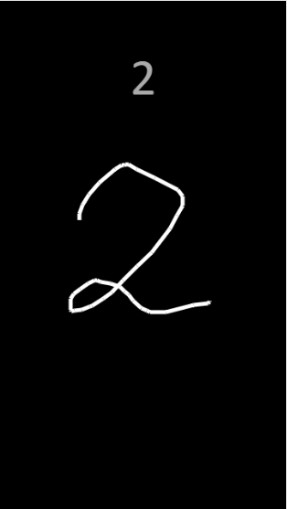
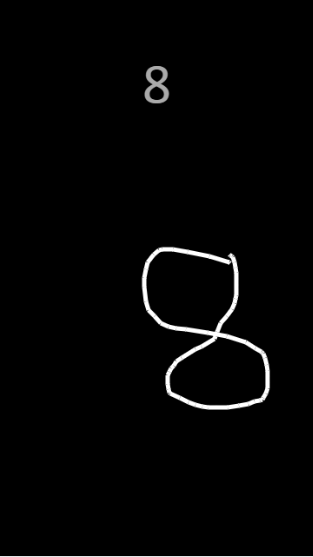

# OCR with Javascript

There is my simple OCR library written in Javascript. It recognizes only numbers (for now). I used Phaser Game Framework for background.
The file MusskyOCR.js is the main OCR algorithm file. Other files are for drawing canvas stuff.

You need to draw at once. When you mouseup, the algorithm begins to recognize. (Maybe a recognize button can be added after drawing something.) 

I used 10x10 pixel representation within 720x1280 pixel region and Euclidean distance method is used to recognize the number.

I made it for mobile device resolutions, if you want to run it on your web browser, I suggest turn on DevTools then change the browser resolution into mobile resolution

Examples:

